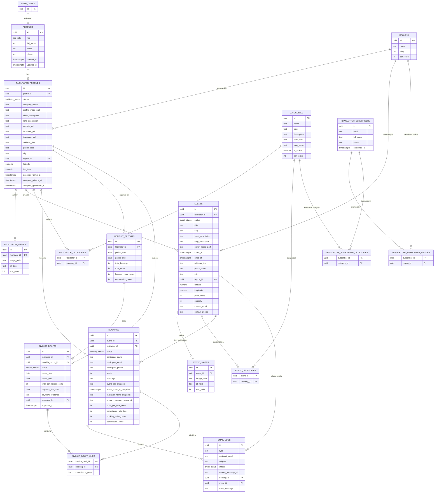

kill 56680
cd "/Users/rasmusmunch/Documents/Spirituel Eventplatform"
npm run preview

# Database-design

Dette database-design er lavet til en Supabase/PostgreSQL-baseret SaaS-platform for spirituelle begivenheder i Danmark.

Designet understøtter:

- Administratorer, facilitatorer og besøgende
- Facilitatorprofiler med billeder, lokation og kategorier
- Begivenheder med kategorier, billeder, status, kapacitet, pris og kortdata
- Tilmeldinger uden bruger-login for besøgende
- Kommissionsberegning uden betaling på platformen
- Nyhedsbrev med region- og kategoriinteresser
- Mail-log, månedsrapporter og fakturakladder
- Fremtidige udvidelser som anmeldelser, favoritter og online betaling

## Designprincipper

- Supabase Auth håndterer login. Applikationsdata ligger i egne tabeller.
- `profiles.id` matcher `auth.users.id`.
- Besøgende kan tilmelde sig events uden konto. Derfor gemmes deltagerdata direkte på `bookings`.
- Pengedata gemmes som heltal i øre, fx `30000` for `300,00 kr.`.
- Kommission gemmes som basis points: `1200` betyder `12%`.
- Tilmeldinger indeholder snapshots af eventtitel, dato, facilitator, kategori og pris, så rapporter og fakturaer ikke ændrer sig, hvis eventet senere redigeres.
- Kategorier og regioner er separate tabeller, så administrator kan styre dem.
- Events gemmer både adressefelter og koordinater til Mapbox.
- Billeder gemmes som Supabase Storage paths, ikke som binære filer i databasen.

## Kerne-enums

### `app_role`

- `admin`
- `facilitator`

Besøgende er som udgangspunkt anonyme og kræver ikke en rolle.

### `facilitator_status`

- `pending`
- `approved`
- `disabled`

### `event_status`

- `draft`
- `active`
- `sold_out`
- `cancelled`
- `completed`

### `booking_status`

- `pending`
- `confirmed`
- `sold_out`
- `cancelled`
- `completed`
- `invoiced`
- `paid`

### `invoice_status`

- `draft`
- `approved`
- `sent`
- `paid`
- `cancelled`

### `email_status`

- `queued`
- `sent`
- `failed`

## Tabeller

### `profiles`

Applikationsprofil for brugere, der logger ind via Supabase Auth.

| Felt | Type | Note |
| --- | --- | --- |
| `id` | `uuid` | PK, FK til `auth.users.id` |
| `role` | `app_role` | Administrator eller facilitator |
| `full_name` | `text` | Navn |
| `email` | `text` | Unik login-mail |
| `phone` | `text` | Valgfri |
| `created_at` | `timestamptz` | Oprettelse |
| `updated_at` | `timestamptz` | Seneste ændring |

### `facilitator_profiles`

Udvidet offentlig og administrativ facilitatorprofil.

| Felt | Type | Note |
| --- | --- | --- |
| `id` | `uuid` | PK |
| `profile_id` | `uuid` | FK til `profiles.id`, unik |
| `status` | `facilitator_status` | Godkendelsesstatus |
| `company_name` | `text` | Valgfri |
| `profile_image_path` | `text` | Supabase Storage path |
| `short_description` | `text` | Kort præsentation |
| `long_description` | `text` | Uddybende tekst |
| `website_url` | `text` | Valgfri |
| `facebook_url` | `text` | Valgfri |
| `instagram_url` | `text` | Valgfri |
| `address_line` | `text` | Adresse |
| `postal_code` | `text` | Postnummer |
| `city` | `text` | By |
| `region_id` | `uuid` | FK til `regions.id` |
| `latitude` | `numeric(9,6)` | Mapbox/geokodning |
| `longitude` | `numeric(9,6)` | Mapbox/geokodning |
| `accepted_terms_at` | `timestamptz` | Handelsbetingelser |
| `accepted_privacy_at` | `timestamptz` | Privatlivspolitik |
| `accepted_guidelines_at` | `timestamptz` | Retningslinjer |
| `created_at` | `timestamptz` | Oprettelse |
| `updated_at` | `timestamptz` | Seneste ændring |

### `facilitator_images`

Ekstra profilbilleder for facilitatorer.

| Felt | Type | Note |
| --- | --- | --- |
| `id` | `uuid` | PK |
| `facilitator_id` | `uuid` | FK |
| `image_path` | `text` | Supabase Storage path |
| `alt_text` | `text` | Tilgængelighed |
| `sort_order` | `int` | Rækkefølge |
| `created_at` | `timestamptz` | Oprettelse |

### `regions`

Geografiske områder til filtrering og nyhedsbreve.

| Felt | Type | Note |
| --- | --- | --- |
| `id` | `uuid` | PK |
| `name` | `text` | Fx Storkøbenhavn |
| `slug` | `text` | Unik URL-værdi |
| `sort_order` | `int` | Rækkefølge |
| `created_at` | `timestamptz` | Oprettelse |

### `categories`

Spirituelle kategorier.

| Felt | Type | Note |
| --- | --- | --- |
| `id` | `uuid` | PK |
| `name` | `text` | Fx Yoga |
| `slug` | `text` | Unik URL-værdi |
| `description` | `text` | Valgfri |
| `color_hex` | `text` | Markørfarve |
| `icon_name` | `text` | Ikon-reference |
| `is_active` | `boolean` | Synlig/aktiv |
| `sort_order` | `int` | Rækkefølge |
| `created_at` | `timestamptz` | Oprettelse |
| `updated_at` | `timestamptz` | Seneste ændring |

### `facilitator_categories`

Mange-til-mange relation mellem facilitatorer og kategorier.

| Felt | Type | Note |
| --- | --- | --- |
| `facilitator_id` | `uuid` | FK |
| `category_id` | `uuid` | FK |

### `events`

Begivenheder oprettet af facilitatorer.

| Felt | Type | Note |
| --- | --- | --- |
| `id` | `uuid` | PK |
| `facilitator_id` | `uuid` | FK |
| `status` | `event_status` | Draft/aktiv/aflyst osv. |
| `title` | `text` | Titel |
| `slug` | `text` | URL-værdi |
| `short_description` | `text` | Kort tekst |
| `long_description` | `text` | Lang tekst |
| `cover_image_path` | `text` | Supabase Storage path |
| `starts_at` | `timestamptz` | Start |
| `ends_at` | `timestamptz` | Slut |
| `address_line` | `text` | Adresse |
| `postal_code` | `text` | Postnummer |
| `city` | `text` | By |
| `region_id` | `uuid` | FK |
| `latitude` | `numeric(9,6)` | Mapbox |
| `longitude` | `numeric(9,6)` | Mapbox |
| `price_cents` | `int` | Pris pr. deltager inkl. moms |
| `capacity` | `int` | Maks antal pladser |
| `contact_email` | `text` | Kontakt |
| `contact_phone` | `text` | Kontakt |
| `facebook_url` | `text` | Valgfri |
| `instagram_url` | `text` | Valgfri |
| `created_at` | `timestamptz` | Oprettelse |
| `updated_at` | `timestamptz` | Seneste ændring |

Ledige pladser beregnes fra `capacity - sum(bookings.seats)` for bekræftede og afventende tilmeldinger.

### `event_images`

Ekstra begivenhedsbilleder.

| Felt | Type | Note |
| --- | --- | --- |
| `id` | `uuid` | PK |
| `event_id` | `uuid` | FK |
| `image_path` | `text` | Supabase Storage path |
| `alt_text` | `text` | Tilgængelighed |
| `sort_order` | `int` | Rækkefølge |
| `created_at` | `timestamptz` | Oprettelse |

### `event_categories`

Mange-til-mange relation mellem events og kategorier.

| Felt | Type | Note |
| --- | --- | --- |
| `event_id` | `uuid` | FK |
| `category_id` | `uuid` | FK |

### `bookings`

Tilmeldinger til begivenheder.

| Felt | Type | Note |
| --- | --- | --- |
| `id` | `uuid` | PK |
| `event_id` | `uuid` | FK |
| `facilitator_id` | `uuid` | FK |
| `status` | `booking_status` | Afventer, bekræftet osv. |
| `participant_name` | `text` | Deltager |
| `participant_email` | `text` | Deltager |
| `participant_phone` | `text` | Deltager |
| `seats` | `int` | Antal pladser |
| `message` | `text` | Maks. ca. 200 ord valideres i app |
| `event_title_snapshot` | `text` | Faktura-/rapporthistorik |
| `event_starts_at_snapshot` | `timestamptz` | Faktura-/rapporthistorik |
| `facilitator_name_snapshot` | `text` | Faktura-/rapporthistorik |
| `primary_category_snapshot` | `text` | Faktura-/rapporthistorik |
| `price_per_seat_cents` | `int` | Snapshot |
| `commission_rate_bps` | `int` | Default `1200` |
| `booking_value_cents` | `int generated` | Pris gange pladser |
| `commission_cents` | `int generated` | 12% ved betalte events |
| `created_at` | `timestamptz` | Oprettelse |
| `updated_at` | `timestamptz` | Seneste ændring |

### `newsletter_subscribers`

Nyhedsbrevstilmeldinger uden login.

| Felt | Type | Note |
| --- | --- | --- |
| `id` | `uuid` | PK |
| `email` | `text` | Unik |
| `full_name` | `text` | Valgfri |
| `status` | `text` | `active` eller `unsubscribed` |
| `confirmed_at` | `timestamptz` | Double opt-in senere |
| `created_at` | `timestamptz` | Oprettelse |
| `updated_at` | `timestamptz` | Seneste ændring |

### `newsletter_subscriber_regions`

Interesseområder for nyhedsbrev.

| Felt | Type | Note |
| --- | --- | --- |
| `subscriber_id` | `uuid` | FK |
| `region_id` | `uuid` | FK |

### `newsletter_subscriber_categories`

Interessekategorier for nyhedsbrev.

| Felt | Type | Note |
| --- | --- | --- |
| `subscriber_id` | `uuid` | FK |
| `category_id` | `uuid` | FK |

### `email_logs`

Log over mails sendt via Resend.

| Felt | Type | Note |
| --- | --- | --- |
| `id` | `uuid` | PK |
| `type` | `text` | Fx booking-created |
| `recipient_email` | `text` | Modtager |
| `subject` | `text` | Emne |
| `status` | `email_status` | Kørt/send/fejl |
| `resend_message_id` | `text` | Ekstern ID |
| `booking_id` | `uuid` | Valgfri FK |
| `event_id` | `uuid` | Valgfri FK |
| `error_message` | `text` | Ved fejl |
| `created_at` | `timestamptz` | Oprettelse |
| `sent_at` | `timestamptz` | Sendt |

### `monthly_reports`

Månedsrapport pr. facilitator.

| Felt | Type | Note |
| --- | --- | --- |
| `id` | `uuid` | PK |
| `facilitator_id` | `uuid` | FK |
| `period_start` | `date` | Første dag |
| `period_end` | `date` | Sidste dag |
| `total_bookings` | `int` | Snapshot |
| `total_seats` | `int` | Snapshot |
| `booking_value_cents` | `int` | Snapshot |
| `commission_cents` | `int` | Snapshot |
| `created_at` | `timestamptz` | Oprettelse |

### `invoice_drafts`

Fakturakladder til facilitatorer.

| Felt | Type | Note |
| --- | --- | --- |
| `id` | `uuid` | PK |
| `facilitator_id` | `uuid` | FK |
| `monthly_report_id` | `uuid` | Valgfri FK |
| `status` | `invoice_status` | Draft/godkendt/sendt osv. |
| `period_start` | `date` | Periode |
| `period_end` | `date` | Periode |
| `total_commission_cents` | `int` | Total |
| `payment_due_date` | `date` | Betalingsfrist |
| `bank_details` | `text` | Bankoplysninger |
| `payment_reference` | `text` | Reference |
| `approved_by` | `uuid` | FK til admin profile |
| `approved_at` | `timestamptz` | Godkendelse |
| `created_at` | `timestamptz` | Oprettelse |
| `updated_at` | `timestamptz` | Seneste ændring |

### `invoice_draft_lines`

Tilmeldinger, der indgår i en fakturakladde.

| Felt | Type | Note |
| --- | --- | --- |
| `invoice_draft_id` | `uuid` | FK |
| `booking_id` | `uuid` | FK |
| `commission_cents` | `int` | Snapshot |

### `content_pages`

Redigerbare indholdssider, fx handelsbetingelser og privatlivspolitik.

| Felt | Type | Note |
| --- | --- | --- |
| `id` | `uuid` | PK |
| `slug` | `text` | Unik |
| `title` | `text` | Titel |
| `body` | `text` | Markdown/HTML efter valg |
| `is_published` | `boolean` | Synlig |
| `created_at` | `timestamptz` | Oprettelse |
| `updated_at` | `timestamptz` | Seneste ændring |

## ER-diagram



## Vigtige relationer

- En `profile` kan være administrator eller facilitator.
- En facilitator har præcis én `facilitator_profile`.
- En facilitator kan have flere kategorier.
- En begivenhed tilhører én facilitator og kan have flere kategorier.
- En begivenhed har én primær region, men kan vises på kort via koordinater.
- En booking tilhører én begivenhed og én facilitator.
- En booking gemmer økonomiske snapshots, så fakturering forbliver stabil.
- En fakturakladde består af bookinglinjer.
- Nyhedsbrevsmodtagere kan abonnere på flere regioner og kategorier.

## Beregnede felter

### Ledige pladser

Ledige pladser beregnes i en view eller query:

```sql
capacity - coalesce(sum(bookings.seats), 0)
```

Kun bookinger med status `pending` eller `confirmed` bør tælle mod kapaciteten.

### Samlet bookingværdi

```sql
price_per_seat_cents * seats
```

### Kommission

```sql
case
  when price_per_seat_cents > 0 then round(price_per_seat_cents * seats * commission_rate_bps / 10000.0)
  else 0
end
```

## Anbefalede views

### `event_capacity_view`

Viser samlet antal reserverede pladser og ledige pladser pr. event.

### `admin_booking_overview`

Samler booking, event, facilitator, kategori, status, bookingværdi og kommission til administrator-dashboard.

### `facilitator_monthly_totals`

Aggregerer bookinger pr. facilitator og måned til rapporter og fakturakladder.

## RLS-principper

Supabase Row Level Security bør aktiveres på alle applikationstabeller.

Anbefalede regler:

- Public read: aktive kategorier, regioner, godkendte facilitatorprofiler og aktive fremtidige events.
- Public insert: `bookings` og `newsletter_subscribers`, men kun via kontrollerede server actions/API-ruter med validering.
- Facilitator read/write: egne facilitatorprofil, egne events, egne eventbilleder og bookinger på egne events.
- Facilitator read: egne rapporter og fakturakladder.
- Admin full access: alle tabeller.
- Service role only: `email_logs`, rapportgenerering og fakturagenerering.

## Indekser

Anbefalede indekser:

- `profiles(role)`
- `facilitator_profiles(status, region_id)`
- `events(status, starts_at)`
- `events(region_id, starts_at)`
- `events(facilitator_id, starts_at)`
- `events(latitude, longitude)`
- `bookings(event_id, status)`
- `bookings(facilitator_id, created_at)`
- `bookings(status, created_at)`
- `event_categories(category_id, event_id)`
- `facilitator_categories(category_id, facilitator_id)`
- `newsletter_subscribers(email)`

## Første seed-data

Regioner:

- Hele Danmark
- Storkøbenhavn
- Nordsjælland
- Midtsjælland
- Sydsjælland
- Vestsjælland
- Fyn
- Bornholm
- Sønderjylland
- Midtjylland
- Nordjylland

Kategorier:

- Yoga
- Meditation
- Ceremoni
- Shamanisme
- Saunagus
- Lydbad
- Coaching
- Retreat
- Musik & Dans
- Foredrag
- Undervisning
- Healing
- Breathwork
- Mindfulness
- Kropsarbejde
- Naturforløb
- Spirituel Udvikling

